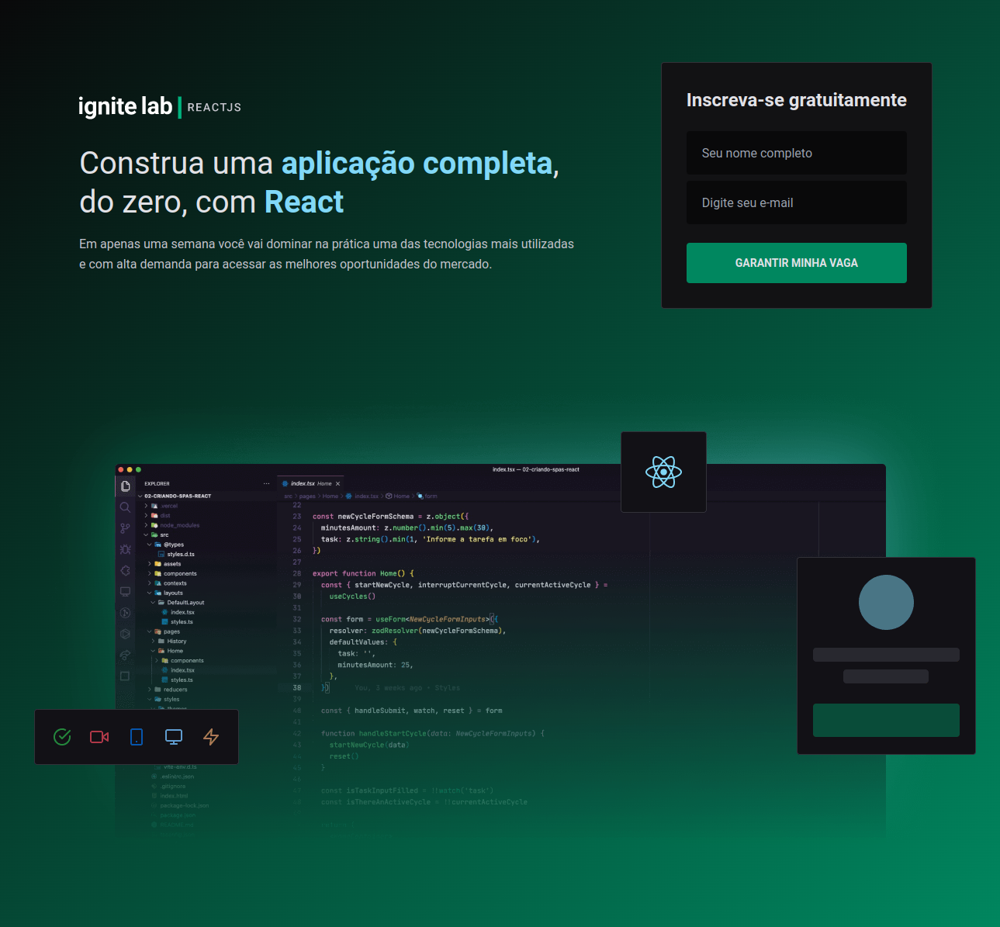

<div align="center" id="top"> 
  

</div>

<h1 align="center">Event Platform</h1>

<p align="center">
  

  

  

  

 
</p>

<p align="center">
  <a href="#dart-sobre">Sobre</a> &#xa0; | &#xa0; 
  <a href="#sparkles-funcionalidades">Funcionalidades</a> &#xa0; | &#xa0;
  <a href="#rocket-tecnologias">Tecnologias</a> &#xa0; | &#xa0;
  <a href="#white_check_mark-pré-requisitos">Pré requisitos</a> &#xa0; | &#xa0;
  <a href="#checkered_flag-começando">Começando</a> &#xa0; | &#xa0;
  <a href="#memo-licença">Licença</a> &#xa0; | &#xa0;
  <a href="https://github.com/Gabriel4420" target="_blank">Autor</a>
</p>

<br>

## :dart: Sobre ##

Criamos 2 paginas com integração ao graphcms, utilizando apollo client, graphql-gen e tailwind na estilização. A primeira página, referente a captação de inscritos no evento, e a segunda pagina, referente ao proprio evento em si, aonde o evento possui um video player, titulo, descrições da video-aula, e todas as aulas em uma sidebar lateral.

## :sparkles: Funcionalidades ##

:heavy_check_mark: CRUD de subscribers;\
:heavy_check_mark: Integração com graphcms, para crud de lessons, teachers e challenges;\
:heavy_check_mark: Agendamento de lessons, aonde a lesson só vai ser liberada no dia em que foi agendada;

## :rocket: Tecnologias ##

As seguintes ferramentas foram usadas na construção do projeto:

- [@apollo/client](https://www.apollographql.com/docs/react/)
- [Node.js](https://nodejs.org/en/)
- [React](https://pt-br.reactjs.org/)
- [date-fns](https://date-fns.org/)
- [phosphor-react](https://phosphoricons.com/)
- [graphQl](https://phosphoricons.com/)
- [TypeScript](https://www.typescriptlang.org/)

## :white_check_mark: Pré requisitos ##

Antes de começar :checkered_flag:, você precisa ter o [Git](https://git-scm.com) e o [Node](https://nodejs.org/en/) instalados em sua maquina.

## :checkered_flag: Começando ##

```bash
# Clone este repositório
$ git clone https://github.com/Gabriel4420/event-platform


# Instale as dependências
$ yarn

# Para iniciar o projeto
$ yarn dev

# O app vai inicializar em <http://localhost:3000>
```

## :memo: Licença ##

Este projeto está sob licença MIT. Veja o arquivo [LICENSE](LICENSE.md) para mais detalhes.

<a href="#top">Voltar para o topo</a>

&#xa0;

<h4 align="center">
  Feito com ❤️ por Gabriel Rodrigues 👋️ <a href="mailto:gabriel_rodrigues_perez@hotmail.com">Entre em contato!</a>
</h4>

<p align="center">

  <a href="https://www.linkedin.com/in/gabriel-rodrigues-perez-2069b072/">
    
  </a>
  <a href="https://www.facebook.com/gabriel.rodrigues.perez">
    
  </a>
  <a href="https://www.instagram.com/gabriel_rodrigues_perez/">
    
  </a>
  
  
</p>


